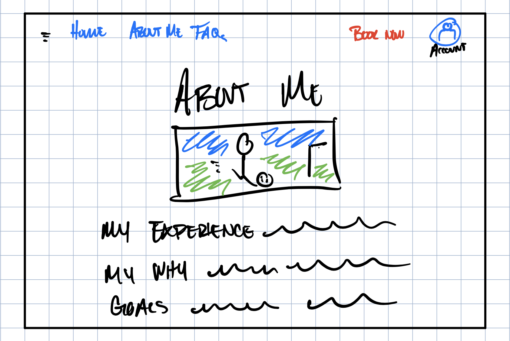
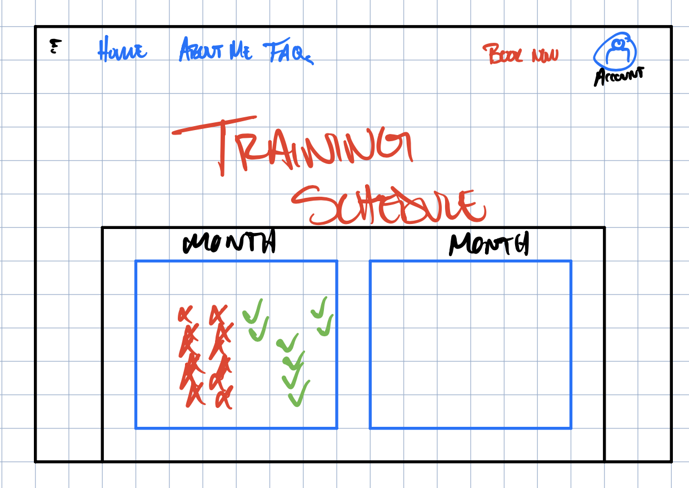
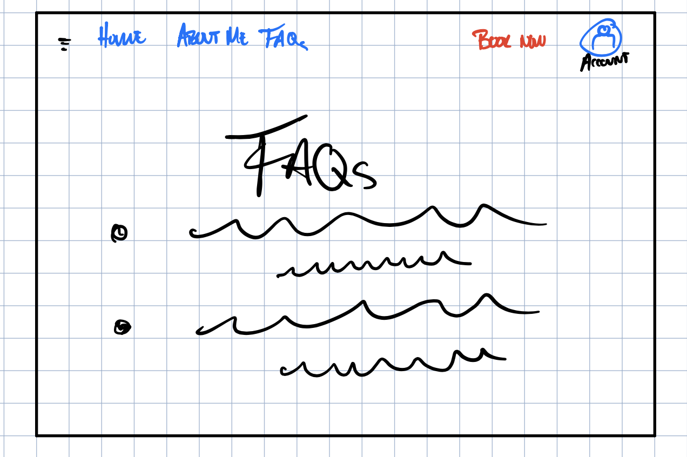

# web-startup

### Elevator Pitch
How much money do you spend on your children's sports activities each year? How do you know if your child is progressing? With just under $40B spent annually, the global youth sports industry lacks clear communication. This website is where parents, players, and coaches efficiently understand their progress. Book trainings, coach virtually, and log player progress all in one place. 

### Key Features
- Secure login over HTTPS
- Account creation and overview
- Schedule of available training session times
- Customize training content and length 
- Schedule and reserve trainings online
- Display training types and details
- View training session feedback in user account
- Web pages: Home, FAQs, About Me, User Login/Account

### Use of Technology
- [ ] HTML - Uses HTML for two pages:
  1. Home **DONE**
  2. Login **DONE**
  3. About Me **DONE**

- [ ] CSS - Application styles that are adaptable to desktop and mobile devices, follow good UX design principles, and emphasize value of website.
- [ ] JavaScript: Interactive menu for FAQ page and training schedule.
- [ ] React - Provides login, training schedule, training customization, and display trainer feedback.
- [ ] Web Service - Backend service for:
  - user login
  - reserved trainings
  - display trainer feedback
- [ ] Authentication - User account creation and identification **Placeholder**
- [ ] Database Data/Login - Store the following information: **Placeholder**
  - user/player information (Name, email, phone, age)
  - training date
  - performance evaluation 
- [ ] WebSocket Data - As a user books a training, it is added to their upcoming trainings **Placeholder**
  - coaching feedback 
- [ ] WebSocket Data - As a user completes a training, it is added to their training history

### Design Images

### Startup HTML Assignment Completion
- Simon HTML deployed to production environment
- GitHub startup repository in web footer
- Notes in Git repository
- Git commits
- HTML pages for home, about, login, and myaccount pages
- Body, nav, main, header, footer on every page
- Links between pages in header on every page
- Text on each page
- Placeholder for 3rd party service calls on about page for Google Maps
- One or more images included on home and about pages
- Login placeholder and username display on login page
- WebSocket data placeholder on myaccount page showing player performance history and assessment

### Startup CSS Assignment Completion
- Simon CSS deployed to production environment
- Properly styled CSS header, footer, and main content body
- This criterion is linked to a Learning OutcomeProperly styled CSS navigation elements
- Responsive window resizing
- Properly styled CSS application elements
- Properly styled CSS application text content
- Properly styled CSS application images

### Startup React Assignment Completion
- Simon React deployed to production environment
- Git commits demonstrate ownership
- Bundled using Vite
- Multiple react components that implement or mock all app functionality
  1. Login component to mock service authentication
  2. About page random quote placeholder
  3. User training history table input logic on My Account page (must log in first)
- React router
- React hooks applied on login.jsx and app.jsx

### Startup Service Assignment Completion
- Simon Service deployed to production environment
- Git commits demonstrate ownership
- Create an HTTP service using Node.js and Express
- Frontend served up using Express static middleware
- Frontend calls third party service endpoints: Premier League Table on About page
- Backend provides service endpoints
- Frontend calls your service endpoints

### Startup Login Assignment Completion (Login -> My Account page)
- Simon Login deployed to production environment
- Git commits demonstrate ownership
- Supports new user registration
- Supports existing user authentication
- Stores application data in MongoDB
- Stores and retrieves credentials in MongoDB
- Restricts application functionality based upon authentification

### Startup WebSocket Assignment Completion 
- Simon WebSocket deployed to production environment
- Git commits demonstrate ownership
- Backend listens for WebSocket connection
- Frontend makes WebSocket connection
- Data sent over WebSocket connection
- WebSocket data displayed in the application interface (incomplete)
- All visible elements are working