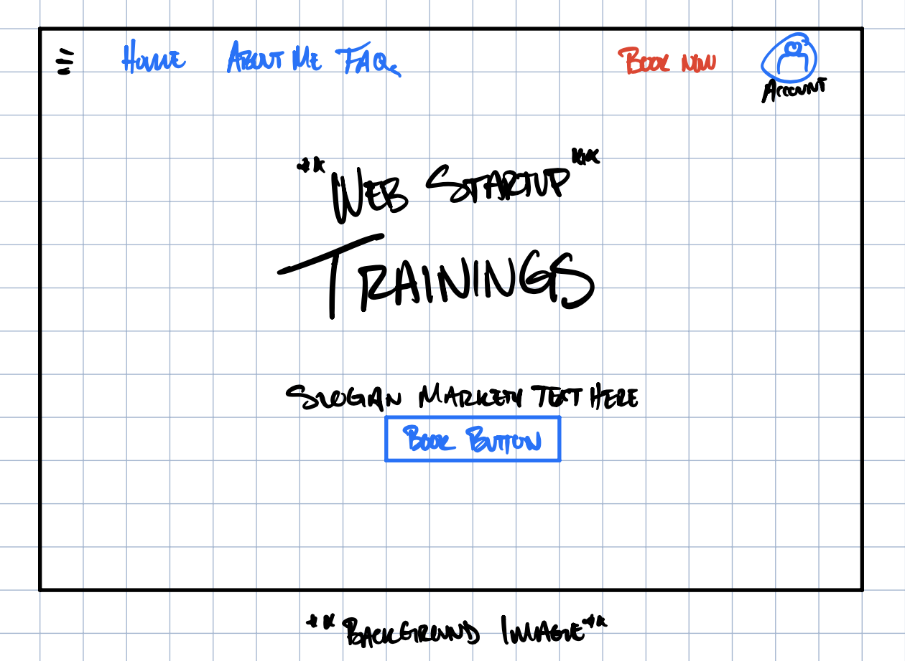

# web-startup

### Elevator Pitch
How much money do you spend on your children's sports activities each year? How do you know if your child is progressing? With just under $40B spent annually, the global youth sports industry lacks clear communication. This website is where parents, players, and coaches efficiently understand their progress. Book trainings, coach virtually, and log player progress all in one place. 

### Key Features
- Secure login over HTTPS
- Account creation and overview
- Schedule of available training session times
- Customize training content and length 
- Schedule and reserve trainings online
- Display training types and details
- View training session feedback in user account
- Web pages: Home, FAQs, About Me, User Login/Account

### Use of Technology
- [ ] HTML - Uses HTML for two pages:
  1. Home
  2. Login
  3. About Me
- [ ] CSS - Application styles that are adaptable to desktop and mobile devices, follow good UX design principles, and emphasize value of website.
- [ ] JavaScript: Interactive menu for FAQ page and training schedule.
- [ ] React - Provides login, training schedule, training customization, and display trainer feedback.
- [ ] Web Service - Backend service for:
  - user login
  - reserved trainings
  - display trainer feedback
- [ ] Authentication - User account creation and identification
- [ ] Database Data/Login - Store the following information:
  - user/player information (Name, email, phone, age)
  - training date
  - performance evaluation 
- [ ] WebSocket Data - As a user books a training, it is added to their upcoming trainings

### Design Images

